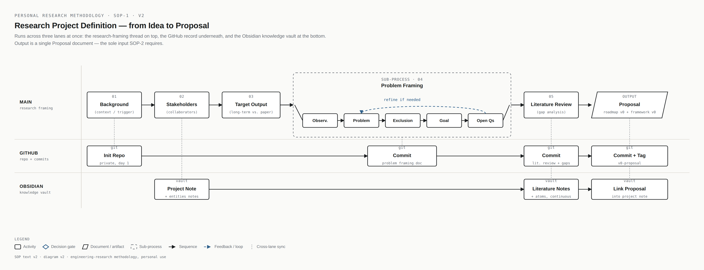
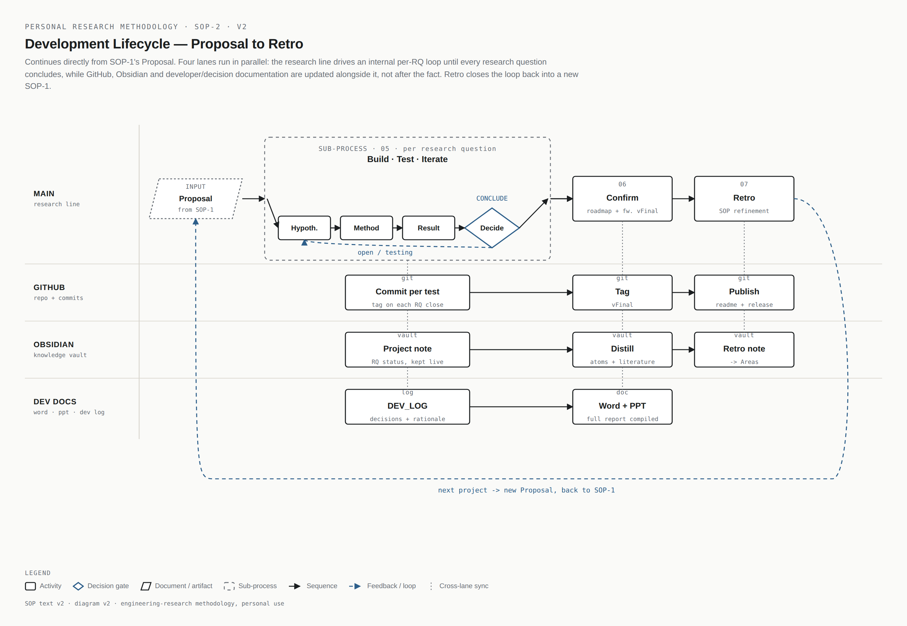

# template-rq-driven-research

A personal template for engineering research projects. It packages two standard operating procedures (SOPs) — how a project gets **defined**, and how it gets **built, documented, and published** — into a ready-to-clone repository structure. GitHub carries the code and version history; [Obsidian](https://obsidian.md) (a separate, long-lived vault shared across all projects, not part of this repo) carries cross-project knowledge. This template is the GitHub half of that pair.

The core idea running through both SOPs: every experiment, commit, and note is anchored to a research question (RQ). Research Roadmap and Technical Framework are not free-form diagrams — they are the visible state of the RQs (open / testing / concluded) at a point in time, versioned like everything else.

## SOP-1 — Project Definition (Proposal in, Proposal out)

Turns an initial idea into a single Proposal document, moving across three lanes at once: the research-framing thread, the GitHub record, and the Obsidian vault.

1. **Background** — context and trigger for the project.
2. **Stakeholders** — collaborators, supervisors, data owners; mirrored as entries in the Obsidian vault's Entities.
3. **Target Output** — is this a long-running thread (e.g. a thesis chapter), or aimed at a specific conference/journal deadline? This shapes the depth and pace of everything after it.
4. **Problem Framing** (sub-process) — observations → problem statement → scope exclusion → preliminary goal → open questions, with a refine loop back to the problem statement if needed.
5. **Literature Review** — reading done against the problem statement, producing a gap analysis rather than a summary.
6. **Proposal** (output) — the research questions (RQ1…RQn), Research Roadmap v0, and Technical Framework v0. This is the *only* artifact SOP-2 needs.



Working templates: [`docs/00_project_definition.md`](docs/00_project_definition.md) · [`docs/01_literature_review.md`](docs/01_literature_review.md) · [`docs/02_proposal.md`](docs/02_proposal.md)

## SOP-2 — Development Lifecycle (Proposal to Retro)

Continues directly from SOP-1's Proposal — it does not repeat definition or literature work. Four lanes run in parallel rather than in sequence: the research line drives the work, while GitHub, the Obsidian vault, and developer/decision documentation are updated alongside it, not after the fact.

- **Main** — a per-RQ loop (Hypothesis → Method → Result → Decide) runs inside **Build · Test · Iterate** until every RQ reaches CONCLUDE, then **Confirm** locks Roadmap vFinal and Framework vFinal, then **Retro** closes the loop back into a new SOP-1.
- **GitHub** — a commit per test, a tag on every RQ closure, a tag on vFinal, then the README and release at Retro. History is never rewritten; a clean public history, if ever wanted, is built on a derived copy, not this one.
- **Obsidian** — the project's vault entry stays live with RQ status during iteration, then gets distilled into reusable Atoms/Literature notes, then a short retro note lands in the long-term methodology Area.
- **Dev Docs** — `docs/DEV_LOG.md` collects debugging notes and decision rationale (including the options *not* taken) as they happen; the Word report and PPT are compiled once, after Confirm, from the log and the RQ history.



Working documents: [`docs/RQ_MAPPING.md`](docs/RQ_MAPPING.md) · [`docs/DEV_LOG.md`](docs/DEV_LOG.md) · [`docs/CHANGELOG.md`](docs/CHANGELOG.md)

## Repository structure

```
.
├── README.md                 this file — narrative + both SOP diagrams
├── AGENTS.md                 collaboration protocol for AI assistants (Codex, Claude, etc.)
├── .gitignore
├── .env.example
├── requirements.txt
│
├── docs/
│   ├── 00_project_definition.md   SOP-1 steps 1-4 (background, stakeholders, target output, problem framing)
│   ├── 01_literature_review.md    SOP-1 step 5 (gap analysis)
│   ├── 02_proposal.md             SOP-1 output (RQs + roadmap v0 + framework v0)
│   ├── RQ_MAPPING.md              live RQ status, maintained throughout SOP-2
│   ├── DEV_LOG.md                 continuous decision/debugging log
│   ├── CHANGELOG.md               why the roadmap/framework changed, version to version
│   └── assets/                    the two SOP diagrams above
│
├── config/                   stage-specific configuration files
├── src/                      core library code
├── experiments/               one folder per research stage, see experiments/README.md for naming
├── data/                      raw data (git-ignored — kept local only)
├── demo_data/                  small tracked sample, enough to run a demo without the full dataset
├── reports/
│   ├── images/                 research_roadmap.png / technical_framework.png (this project's own, not the SOP diagrams above)
│   └── README.md               naming convention for the Word report and PPT
└── archive/                    superseded material, kept rather than deleted
```

## Using this template

1. Click **Use this template** on GitHub to create a new, history-free repository for the new project.
2. Work through `docs/00_project_definition.md` → `01_literature_review.md` → `02_proposal.md`. Commit each as it's finished; tag `v0-proposal` once the Proposal is done.
3. Create the matching project entry note in the Obsidian vault (Projects) and link it back to the new repo; mirror stakeholders into Entities.
4. Start SOP-2: work `docs/RQ_MAPPING.md` per RQ, log decisions in `docs/DEV_LOG.md` as they happen, commit and tag as each RQ concludes.
5. After the last RQ concludes, update `docs/CHANGELOG.md`, tag `vFinal`, compile the Word report + PPT into `reports/`, and distill the vault notes.
6. Decide licensing and public visibility at that point — this template intentionally ships without a `LICENSE` file so that choice isn't made prematurely.

## Provenance

Structure and conventions drawn from running one full project this way (welding-defect visual detection, CIRP CCMPM submission) end to end, and cross-checked against established engineering/research templates — [Cookiecutter Data Science](https://cookiecutter-data-science.drivendata.org/) and [The Turing Way's reproducible-project-template](https://github.com/the-turing-way/reproducible-project-template) — without copying either verbatim.
